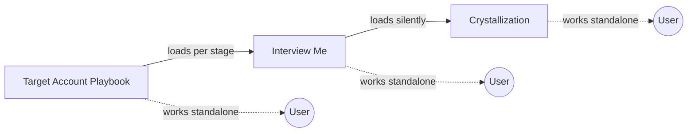

# GTM Skills

Distributable Claude Code skills for B2B GTM work, built by the MedScout GTM team. v1 ships three skills designed to work together, though each is useful on its own.

## What's in here

| Skill | What it does | When to reach for it |
|---|---|---|
| **Target Account Playbook** | Staged facilitation that builds an account qualification framework — attributes that matter, signals that help assess them, and where signals become findable across your sales process. | You want a clear, shared rubric for "is this account worth pursuing?" — backed by real customer examples, not just hypotheses. |
| **Interview Me** | Conversational thought partner that turns fuzzy thinking (voice-to-text brain dumps, half-formed ideas) into sharp articulation. | You have something half-formed you need to think through out loud. |
| **Crystallization** | The core methodology behind Interview Me — synthesis + friction cycles that sharpen thinking into documented clarity. | You already know what you mean but can't quite say it; or you have a rough artifact that needs sharpening. |

## How they fit together

Target Account Playbook is the hub — it's the one most users trigger. Under the hood, it loads Interview Me at each stage to run the conversation, and Interview Me loads Crystallization as its thinking methodology. Each skill is also usable on its own: Interview Me for any clarification workflow, Crystallization for sharpening an existing draft.

## What the Playbook produces

One document: a qualification framework with written context and a rubric organized by **when** in your process each criterion becomes assessable. The framework distinguishes:

- **Attributes** — traits that matter (e.g., "commercial maturity," "openness to innovation"). No single data point captures these.
- **Signals** — observable indicators that help you assess an attribute. Multiple signals per attribute, each findable at different stages.
- **Assessment timing** — where a signal becomes checkable (pre-engagement research vs. sales conversations vs. post-sale behavior).

The output is meant to be used — by reps, by marketing, by ops — not filed and forgotten.

## The philosophy

**Most qualification frameworks live in someone's head.** The best reps and leaders have a sharp instinct for "good account" vs. "not a good account," but the reasoning is implicit — never written down, never shared, never pressure-tested against real data.

This skill package is designed to pull that implicit knowledge out through conversation, test it against real customers, and turn it into something a team can actually use. The output is better than a generic framework because it's grounded in your company's specific examples — and better than a working doc because the process forces you to surface assumptions you didn't know you were making.

Interview Me and Crystallization are the engine. They're skilled at one thing: making fuzzy thinking precise, without putting words in your mouth.

## Web research

The Target Account Playbook gets meaningfully richer when Claude can look up companies you're discussing during Stage 2 fit analysis — it can fill in context beyond what you recall in the moment. Web search is available on all Claude.ai plans (including Team and Enterprise), so this is usually on by default. If your organization has disabled web access, the skill still works — it just relies more heavily on what you bring to the conversation.

## Install

See [INSTALL.md](INSTALL.md). TL;DR: clone this repo, symlink the three skill directories into `~/.claude/skills/`, and Claude Code auto-discovers them.

## Usage

Open Claude Code (or any surface that supports custom skills) and describe what you want to do:

- "Help me build a target account qualification framework"
- "I want to think through [topic] — interview me"
- "I have a rough draft of [X], help me sharpen it"

Claude picks the right skill based on the description. No slash commands required.

## Feedback

Built by [MedScout](https://medscout.io). Issues and improvements welcome — open a PR or issue on this repo.

## License

MIT.
