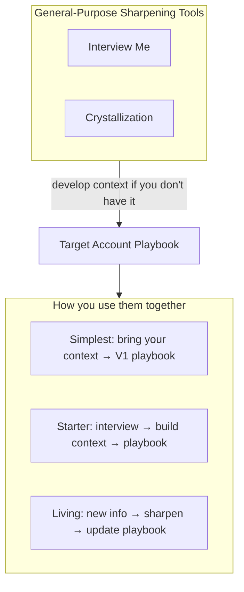

# GTM Skills

Distributable Claude Code skills for B2B GTM work, built by the MedScout GTM team.

## What's in here

### General-purpose sharpening tools

| Skill | What it does |
|---|---|
| **Interview Me** | Conversational thought partner that turns fuzzy thinking into sharp articulation. Voice-to-text brain dumps, half-formed ideas, implicit knowledge that hasn't been written down yet. |
| **Crystallization** | Synthesis + friction cycles that sharpen rough thinking into documented clarity. The methodology behind Interview Me — also useful on its own for tightening an existing draft. |

These are core parts of MedScout's internal systems, ported out. We reach for them anytime we need to sharpen our thinking — regardless of domain. Future skill packs will build on these same tools.

### Domain-specific

| Skill | What it does |
|---|---|
| **Target Account Playbook** | Takes your account qualification context and produces reusable playbook assets for ABX workflows — qualification rubric, signal maps, assessment timing. |

## How they fit together

The Target Account Playbook takes your account qualification context — whatever you have documented about who you sell to, what makes a good fit, and how your team qualifies — and produces reusable playbook assets (rubric, signal maps, assessment timing).

The question is: what if you don't have that context written down? That's what Interview Me and Crystallization are for. They help draw out the implicit knowledge your team already has but hasn't documented.

**Three ways to use this, depending on where you are:**

- **Simplest** — You already have context docs (positioning, ICP notes, prior qualification work). Feed them in, work with Claude, get your V1 playbook elements.
- **Starter** — You don't have much written down. Go through the three interview stages to develop your context assets first, then generate the playbook from those.
- **Living** — Your playbook is never final. When you learn something new — a deal surprises you, your market shifts, a rep surfaces a pattern — kick off a crystallization or interview session, then update your playbook assets with what you found.

## What the Playbook produces

One document: a qualification framework with written context and a rubric organized by **when** in your process each criterion becomes assessable. The framework distinguishes:

- **Attributes** — traits that matter (e.g., "commercial maturity," "openness to innovation"). No single data point captures these.
- **Signals** — observable indicators that help you assess an attribute. Multiple signals per attribute, each findable at different stages.
- **Assessment timing** — where a signal becomes checkable (pre-engagement research vs. sales conversations vs. post-sale behavior).

The output is meant to be used — by reps, by marketing, by ops — not filed and forgotten.

## The philosophy

**Most qualification frameworks live in someone's head.** The best reps and leaders have a sharp instinct for "good account" vs. "not a good account," but the reasoning is implicit — never written down, never shared, never pressure-tested against real data.

This skill package pulls that implicit knowledge out through conversation, tests it against real customers, and turns it into something a team can use. The output is better than a generic framework because it's grounded in your company's specific examples — and better than a working doc because the process forces you to surface assumptions you didn't know you were making.

## Web research

The Target Account Playbook gets meaningfully richer when Claude can look up companies you're discussing during Stage 2 fit analysis — it can fill in context beyond what you recall in the moment. Web search is available on all Claude.ai plans (including Team and Enterprise), so this is usually on by default. If your organization has disabled web access, the skill still works — it just relies more heavily on what you bring to the conversation.

## Before you start

The Target Account Playbook moves faster and produces a sharper framework when you have a few things ready. None are required — the skill adapts to what you bring — but gathering these up front avoids interruptions mid-session.

- **Your current ICP thinking, if any.** A positioning doc, a qualification rubric, notes from a prior exercise. Even a rough one-pager helps. If you don't have anything written, that's fine — the first stage is designed to draw it out through conversation.
- **A shortlist of 3–6 real customers you can talk about.** Ideally a mix: two or three best-fit customers (long-tenured, expanded, strong use case) and two or three poor-fit customers (churned, never got traction, surprise losses). Named accounts you know well — not just logos.
- **Optional but recommended: a rep transcript for Stage 3.** A voice recording of your best rep narrating how they qualify a couple of fresh accounts, thinking out loud. Skip if you don't have it yet — the skill will tell you how to set one up and you can come back to this stage later.
- **Voice-to-text ready.** The interview mechanics assume brain-dump-style input. Typing works, but talking is faster and usually richer.

## What to expect

A full run through all three stages plus framework generation is roughly 90 minutes to 2 hours, spread across one sitting or multiple sessions. Rough shape:

| Stage | What happens | Typical time |
|---|---|---|
| **Stage 1 — Company context** | You describe what you sell, who to, and your current thinking on fit. Short discovery. | 15–30 min |
| **Stage 2 — Fit analysis** | Iterative rounds walking through good-fit and poor-fit customers. The longest stage — where most of the sharpening happens. | 45–75 min |
| **Stage 3 — Rep walkthrough** (optional) | Upload the rep transcript; Claude unpacks it with you. Usually the shortest stage. | 15–30 min |
| **Framework generation** | Claude produces your qualification framework — attributes, signals, assessment timing. You react and refine. | 15–30 min |

The skill transitions you between stages — you don't need to track where you are. At any point you can stop, save the output, and resume later.

**What you'll end up with**: one qualification framework document you can share with your team, plus the session journey behind it (useful context for the framework, and handy when you revisit later).

## Install

See [INSTALL.md](INSTALL.md). TL;DR: clone this repo, symlink the three skill directories into `~/.claude/skills/`, and Claude Code auto-discovers them.

## Usage

Open Claude Code (or any surface that supports custom skills) and describe what you want to do:

- "Help me build a target account qualification framework"
- "I want to think through [topic] — interview me"
- "I have a rough draft of [X], help me sharpen it"

Claude picks the right skill based on the description. No slash commands required.

## Feedback

Built by [MedScout](https://medscout.io). Issues and improvements welcome — open a PR or issue on this repo.

## License

MIT.
